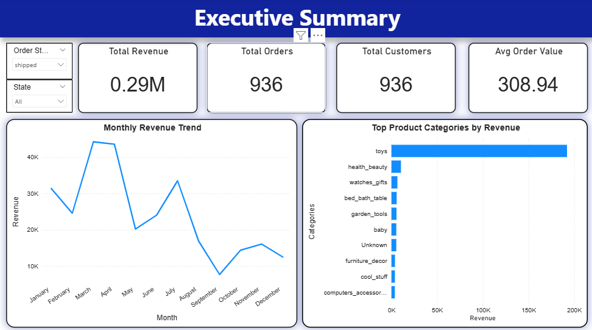
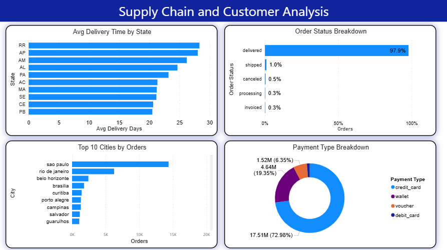

# E-commerce Supply Chain & Customer Analysis Dashboard

> End-to-end e-commerce analytics project using Python, SQL, Power BI, and DAX to analyze supply chain performance, customer ordering behavior, payment trends, and operational efficiency across 100K+ orders.

---

# 1. Overview

This project demonstrates a complete data analytics workflow — from data cleaning and transformation to SQL analysis, interactive dashboard development, and business insight generation.

The dashboard focuses on identifying operational bottlenecks, customer purchasing trends, payment behavior, and delivery performance using Power BI visualizations and DAX measures.

**Core Objective:** Transform raw e-commerce transaction data into actionable business insights to support operational and strategic decision-making.

---

# 2. Dataset

The dataset contains e-commerce transactional and operational data, including:

| Field | Description |
|---|---|
| Order ID | Unique order identifier |
| Customer ID | Unique customer identifier |
| Order Status | Delivered, Shipped, Cancelled, Processing, etc. |
| Purchase Timestamp | Order purchase date/time |
| Delivery Timestamp | Order delivery date/time |
| Estimated Delivery Date | Expected delivery timeline |
| Payment Type | Credit Card, Wallet, Voucher, Debit Card |
| Customer City & State | Geographic customer information |
| Product Category | Product classification |
| Price | Product/order value |

**Dataset Size:** 100K+ orders across multiple Brazilian states and cities.

---

# 3. Tools & Technologies

| Tool | Purpose |
|---|---|
| Python (Pandas) | Data cleaning and preprocessing |
| SQL | Data querying and business analysis |
| Power BI | Interactive dashboard and KPI visualization |
| DAX | Measures, KPIs, percentage calculations |
| Excel | Initial data exploration and validation |

---

# 4. Project Workflow

## Step 1 — Data Loading & Inspection
- Imported e-commerce datasets into Python
- Reviewed null values, duplicates, and data types
- Inspected order status and delivery-related columns

## Step 2 — Data Cleaning
- Removed null and inconsistent records
- Converted timestamp columns into datetime format
- Standardized column names
- Handled missing delivery timestamps
- Removed duplicate entries

## Step 3 — Feature Engineering
- Calculated average delivery time using purchase and delivery dates
- Created delivery performance metrics
- Built DAX percentage measures for order status analysis

## Step 4 — SQL Analysis
Performed business-focused analysis including:
- Top-performing cities by order volume
- Payment method distribution
- Order status trends
- Delivery performance by state
- Customer purchasing distribution

## Step 5 — Dashboard Development (Power BI)

Created a multi-page interactive dashboard including:

### Executive Summary
- KPI Cards
- Revenue & Orders overview
- Category-level analysis

### Supply Chain & Customer Analysis
- Avg delivery time by state
- Order status distribution
- Top 10 cities by orders
- Payment type breakdown

## Step 6 — Dashboard Optimization
- Added DAX measures
- Applied dynamic filtering
- Improved chart formatting and visual consistency
- Added percentage-based insights

---

# 5. Dashboard Preview

## Executive Summary


## Supply Chain & Customer Analysis


---

# 6. Key Results & Insights

## Operational Insights
- Successfully analyzed 100K+ e-commerce orders
- ~97.9% of orders were successfully delivered
- Cancellation and unavailable order rates remained below 1%

## Delivery Performance
- Certain states showed significantly higher average delivery times
- Delivery duration varied between 20–30 days depending on state

## Customer & Geographic Analysis
- Sao Paulo generated the highest order volume
- Major metropolitan cities dominated customer purchases

## Payment Analysis
- Credit cards accounted for ~73% of all transactions
- Wallet and voucher-based payments contributed significantly lower shares

## Business Recommendations

1. Improve logistics operations in high delivery-time states
2. Optimize shipping efficiency for delayed regions
3. Focus marketing efforts on top-performing cities
4. Improve customer retention through payment-based loyalty programs
5. Reduce cancellation rates through proactive order tracking

---

# 7. Power BI Features Used

- KPI Cards
- DAX Measures
- Dynamic Filtering
- Interactive Visualizations
- Bar Charts
- Donut Charts
- Percentage-Based Metrics
- Slicers
- Data Labels & Formatting

---

# 8. Repository Structure

```bash
ecommerce-supply-chain-analysis/
│
├── Ecommerce_Supply_Chain_Analysis.pbix
├── ecommerce_analysis.sql
├── ecommerce_master.csv
├── ecommerce_project.ipynb
├── ecommerce-1.png
├── ecommerce-2.png
├── README.md
├── LICENSE
└── .gitignore
```

---

# 9. How to Run the Project

```bash
# 1. Clone the repository
git clone https://github.com/sanmay16/ecommerce-supply-chain-analysis.git

# 2. Install required libraries
pip install pandas numpy matplotlib

# 3. Run Jupyter notebook
jupyter notebook ecommerce_project.ipynb

# 4. Execute SQL queries
# Run ecommerce_analysis.sql in PostgreSQL/MySQL

# 5. Open Power BI dashboard
# Open Ecommerce_Supply_Chain_Analysis.pbix in Power BI Desktop
```

---

# 10. Learning Outcomes

Through this project, I improved my skills in:
- Power BI Dashboard Development
- DAX Calculations
- SQL Querying
- Data Cleaning
- Data Visualization
- Business Analysis
- KPI Design
- Dashboard Formatting
- Business Storytelling

---

# 11. Business Value

This project replicates the workflow of a real-world data analyst by combining data cleaning, SQL analysis, KPI tracking, dashboard development, and business reporting into a single end-to-end analytics solution.

The project demonstrates the ability to transform raw operational data into decision-ready insights that can support supply chain optimization, customer analysis, and strategic business decisions.

**Skills Demonstrated:** Power BI · DAX · SQL · Python · Data Cleaning · Dashboard Development · KPI Design · Data Visualization · Business Analysis · Business Storytelling
